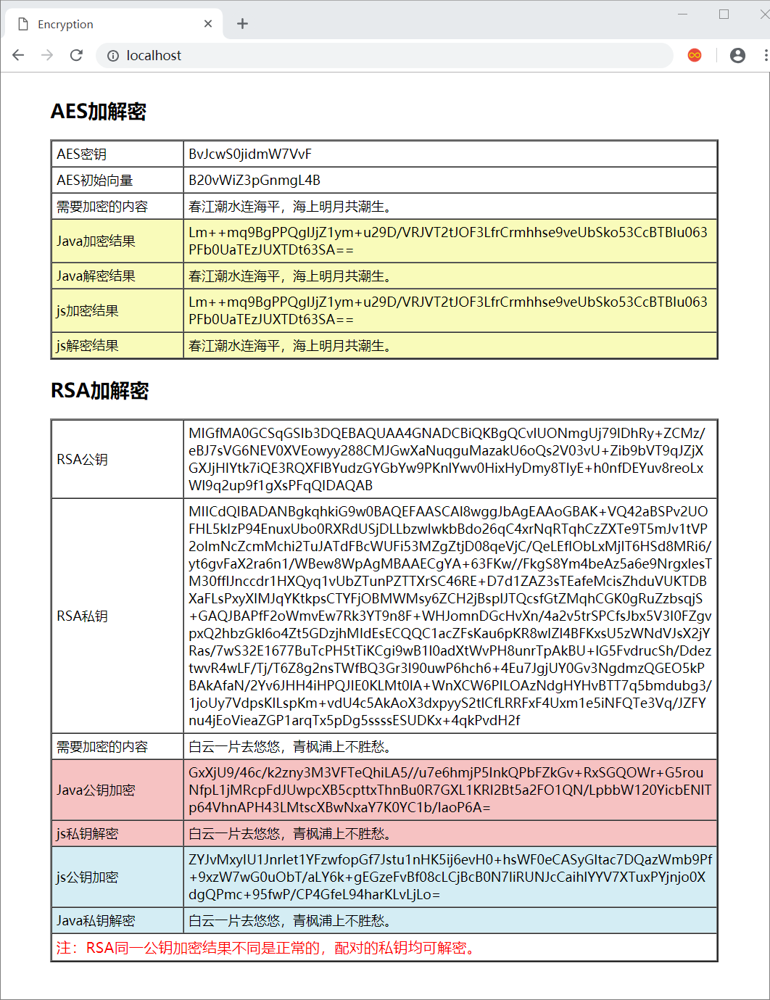

# encryption
Java 和 js 实现 AES 和 RSA 算法的互加解密

### 本地环境

```
JDK版本：1.8
Maven版本：3.5.0
```

### 说明

该项目是由 Maven 构建的标准的 Java 项目，内置了 Jetty 服务器组件。

<font color="red">运行 cn.huangxulin.encryption.Application 中 main 方法即可启动内置的 Jetty 服务器</font>，默认端口是80

项目成功运行后，可以通过浏览器直接访问 http://localhost:80/

其中 Java 和 js 加密解密的交互使用了 jQury 的 Ajax

原文地址：

[Java 和 js 互加解密(1) — AES对称加密算法](https://huangxulin.cn/2018/12/02/encryption-aes/)

[Java 和 js 互加解密(2) — RSA非对称加密算法](https://huangxulin.cn/2018/12/08/encryption-rsa/)



<center>运行截图</center>

